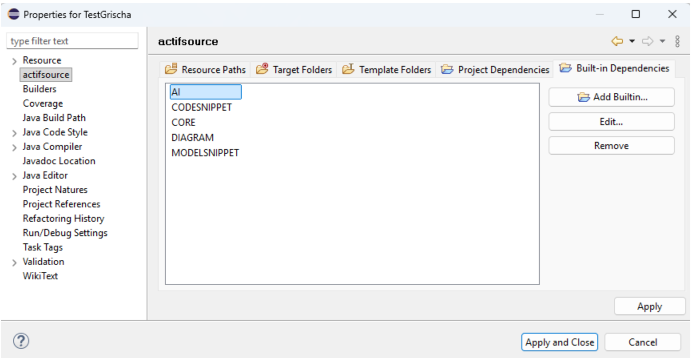
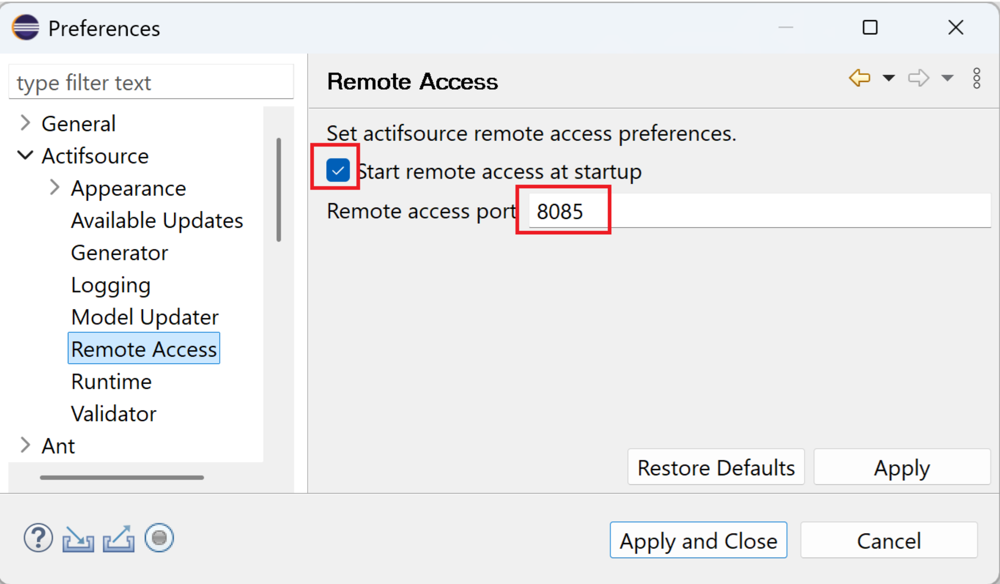

# Extending MCP-Server

With this release, we introduce the MCP Server for connecting Actifsource to an LLM. Through this interface, an LLM can connect to the MCP Server in order to query, modify, and validate resources – and thereby work on existing or new projects as well as trigger code generation. Details on the individual operations are documented in the respective tool descriptions.
In addition, the functionality can be flexibly extended: custom tools, resources, and prompts can easily be made available to the LLM.

The functionality of the MCP Server can easily be extended by adding the built-in function AI and by creating instances of type McpSchema.

## Configuration

In order for Actifsource Eclipse to be accessible as an MCP Server, it must first be enabled under Eclipse -> Preferences. The port on which the server is reachable can also be defined there:

